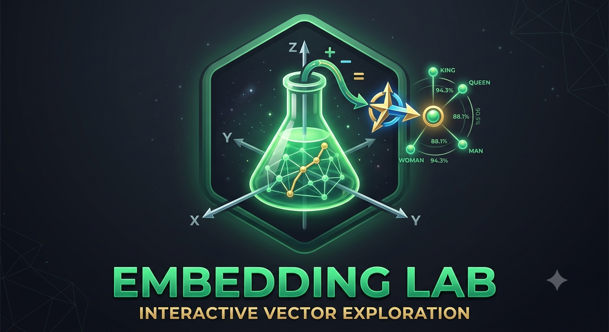

# 🧪 Embedding Lab



## 🚀 Try it live

You can use the hosted app here:

👉 [Open Embedding Lab](https://embedding-lab-7yduhyt8ixtatf2xgvxemy.streamlit.app/)

---

**Embedding Lab** is an interactive intuition lab for one of the most powerful ideas behind modern NLP and Generative AI: **word embeddings**.

Instead of treating embeddings as abstract vectors hidden inside a model, this lab turns them into something you can **build, move, compare, visualize, and experiment with**.

Type a word. Add another. Subtract a concept. Compute the result. Watch the meaning move.

Embedding Lab helps you see that embeddings are not just numbers — they are **semantic positions and directions in a high-dimensional space**.

---

## ✨ Why this exists

Word embeddings are often introduced with famous examples like:

```text
king - man + woman ≈ queen
```

But the real magic is not the example.

The magic is the idea that **meaning can be represented geometrically**.

Words that appear in similar contexts tend to live near each other. Relationships between words often appear as directions. Similarity becomes distance. Analogy becomes movement.

Embedding Lab makes this idea tangible.

It gives students, instructors, and curious practitioners a live playground where they can:

- build vector arithmetic expressions,
- inspect nearest semantic neighbors,
- visualize simplified movement through vector space,
- save intermediate vectors,
- restore previous experiments,
- and develop intuition for how language models represent meaning.

---

## 🚀 What you can do

Embedding Lab lets you explore semantic relationships using simple vector operations.

You can build expressions like:

```text
(paris - france) + italy
```

or:

```text
(king - man) + woman
```

and immediately see the closest words returned by the embedding model.

The app uses **GloVe-Wiki-Gigaword-300**, a **300-dimensional** pretrained word-vector model, and retrieves nearest neighbors using **cosine similarity**.

The result is a small but powerful sandbox for understanding how distributional meaning behaves.

---

## 🧠 Core idea

Embeddings represent words as vectors.

A vector has both:

- a **position** in space, and
- a **direction** relative to other vectors.

Because semantically related words often occupy related regions, we can explore meaning through vector arithmetic:

```text
meaning ≈ movement through vector space
```

This lab is built around that idea.

You are not just reading about embeddings.

You are moving through them.

---

## 🖥️ Run locally

### Requirements

Python **3.11** is recommended.

Install dependencies:

```bash
pip install streamlit gensim==4.3.3 "numpy<2.0" "scipy<1.14" plotly scikit-learn
```

Run the app:

```bash
streamlit run embeddings_intuition.py
```

Then open the local URL printed in your terminal and click **Load Model**.

On first run, the app downloads:

```text
glove-wiki-gigaword-300
```

The initial download is **moderate in size** and is cached locally by Gensim. After the first download, future runs load directly from cache.

> If you previously loaded a different model in the same Streamlit session, restart the server and click **Load Model** again so the GloVe 300 vectors are actually loaded.

---

## 🧭 How the lab works

The app follows a simple three-step flow:

```text
Build Expression → Compute → Discover
```

---

## 1. Build Expression

Start by typing a vocabulary word into the **Term** field.

You can then choose how that word should affect the current expression:

| Button | Action |
|---|---|
| **＋ Add** | Adds the word to the expression |
| **− Sub** | Subtracts the word from the expression |
| **Clear** | Resets the expression and clears the latest result |
| **Compute** | Evaluates the vector expression and finds nearest neighbors |

As you build the expression, each term appears as a removable chip:

- **Green chips** represent added terms.
- **Red chips** represent subtracted terms.

You can remove any term by clicking its chip.

Numbers are not accepted as terms. If a word is not present in the GloVe vocabulary, the app shows a warning and does not add it.

The app also tries common casing variants (`word`, `Word`, `WORD`) when resolving input, so mixed-case typing still works even though GloVe vocabulary is lowercase.

---

## 2. Compute

When you click **Compute**, the app:

1. retrieves the vector for each added term,
2. retrieves the vector for each subtracted term,
3. sums the added vectors,
4. subtracts the subtracted vectors,
5. searches for the nearest words by cosine similarity,
6. excludes the original input words from the result list **case-insensitively** (so `king` and `King` are both filtered out).

For example:

```text
paris - france + italy
```

is interpreted as:

```text
(paris - france) + italy
```

The app then returns the top **5** semantic neighbors for the resulting vector.

---

## 3. Discover

The **Closest Words** panel shows the top **5** nearest words.

Each result includes:

- rank,
- word,
- cosine similarity score,
- proportional similarity bar.

Every neighbor can also become part of a new experiment.

| Button | Action |
|---|---|
| **Add** | Adds the neighbor to the current expression |
| **Subtract** | Subtracts the neighbor from the current expression |
| **Start Fresh** | Clears the expression and starts a new one with that word |

You can also expand **Save this result** to store the computed vector under a custom label (for example `@v1`) and reuse it in later expressions.

This makes exploration feel like semantic browsing: every result can become the next input.

---

## 🧊 Build on discoveries

One of the most powerful parts of Embedding Lab is that every result can become the starting point for a new experiment.

When a computed neighbor catches your attention, you can:

- add it to the current expression,
- subtract it from the current expression,
- start an entirely new exploration from that word,
- or save the computed vector for later reuse.

This creates a natural workflow of discovery:

```text
Compute → Inspect → Extend → Compute Again
```

Rather than running isolated analogies, you can follow semantic trails through the embedding space and observe how meaning shifts with each vector operation.

---

## 📊 Vector Space Visualization

The app includes a simplified **3D PCA visualization** of the current expression.

Since the original embeddings live in **300 dimensions**, the app uses **Principal Component Analysis** to project them into 3 dimensions for visual intuition.

The visualization shows:

- **Origin** at `(0, 0, 0)`,
- **green arrows** for added vector movement,
- **red arrows** for subtracted vector movement,
- **result vector** after computation,
- **nearest-neighbor points** around the computed result.

Before computing, the chart updates as you add or subtract terms.

After computing, it switches to a result-focused view showing the computed vector and its closest semantic neighbors.

> The 3D plot is an intuition aid. Distances in the PCA projection are not identical to distances in the original 300-dimensional embedding space.

---

## 🧾 Experiment History

Every computed expression is automatically recorded in **Experiment History**.

Each history entry stores:

- the expression,
- the top nearest words,
- the computed vector,
- the original add/subtract structure.

You can interact with previous experiments using:

| Button | Action |
|---|---|
| **Restore** | Reloads the expression and result |
| **＋ Add** | Adds the saved result vector to the current expression so you can continue exploring from that point |
| **− Sub** | Subtracts the saved result vector from the current expression so you can use it as a reference direction |
| **Remove** | Deletes the history entry and its saved vector |

This makes the lab useful not only for quick demos, but also for longer chains of exploration.

---

## 🧪 Example experiments

Try these expressions to get started:

| Idea | Add | Subtract | Expression |
|---|---|---|---|
| Country analogy | `paris`, `italy` | `france` | `paris - france + italy` |
| Historical analogy | `gandhi`, `germany` | `india` | `gandhi - india + germany` |
| Product analogy | `microsoft`, `iphone` | `apple` | `microsoft - apple + iphone` |
| Environment contrast | `arctic`, `sand` | `desert` | `arctic - desert + sand` |
| Classic analogy demo | `king`, `woman` | `man` | `king - man + woman` |

Results depend on the vocabulary and training corpus used by GloVe. Some words may be missing, and some analogies may produce surprising or imperfect results.

That is part of the lesson.

Embeddings are powerful, but they are also shaped by data.

---

## 🔬 Technical details

| Item | Value |
|---|---|
| Model | `glove-wiki-gigaword-300` |
| Embedding dimensions | 300 |
| Vocabulary size | ~400k tokens |
| Similarity metric | Cosine similarity |
| Neighbor search | `KeyedVectors.similar_by_vector` |
| Top neighbors shown | 5 |
| Input-term filtering | Case-insensitive exclusion from neighbor results |
| Input lookup | Casing variants tried before vocabulary check |
| Visualization | PCA to 3 components |
| Charting | Plotly `Scatter3d` and 3D arrows |
| Model loading | Gensim downloader (`gd.load`) |
| App state | Streamlit session state |
| Saved vectors | Session-only |
| Persistence | No database or disk writes for saved vectors |

---

## 🧱 Stack

- [Streamlit](https://streamlit.io) — UI
- [Gensim](https://radimrehurek.com/gensim/) — model loading and similarity search
- [GloVe](https://nlp.stanford.edu/projects/glove/) — pre-trained word vectors
- [Plotly](https://plotly.com) — 3D visualization
- [scikit-learn](https://scikit-learn.org) — PCA dimensionality reduction
- [NumPy](https://numpy.org) — vector arithmetic

---

## 🎓 Who this is for

Embedding Lab is useful for:

- students learning NLP or Generative AI,
- instructors teaching embeddings live,
- developers building intuition for vector databases and retrieval,
- practitioners who want to understand semantic similarity beyond the buzzwords,
- anyone curious about how language can become geometry.

---

## 💡 What you learn

By experimenting with this lab, you develop intuition for:

- how words become vectors,
- why cosine similarity is useful,
- how analogies can emerge from vector arithmetic,
- why embeddings capture relationships rather than definitions,
- how high-dimensional meaning can be approximated visually,
- and why modern AI systems rely so heavily on representation learning.

---

## ⚠️ Notes and limitations

This lab is designed for intuition.

It uses pretrained static word embeddings, not contextual transformer embeddings. That means each word has one fixed vector regardless of sentence context.

For example, the word `bank` has one representation, whether it means a river bank or a financial bank.

Modern language models use richer contextual representations, but static embeddings are still one of the clearest ways to understand the foundation:

```text
meaning as geometry
```

---

## 🌟 Why it matters

Embeddings are everywhere in modern AI.

They power semantic search, recommendation systems, retrieval-augmented generation, clustering, classification, and many parts of language understanding.

But they can feel mysterious until you interact with them directly.

Embedding Lab turns that mystery into motion.

It lets you see meaning as movement, similarity as closeness, and analogy as direction.

That is the goal:

> Make embeddings feel less like magic — and more like something you can explore.
